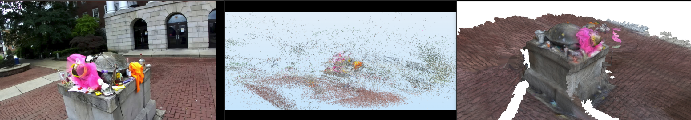

# Structure from Motion (SFM)

An implementation of a Structure from Motion (SFM) pipeline for 3D reconstruction based on the paper *Building Rome in a Day* ([linked here](http://grail.cs.washington.edu/rome/rome_paper.pdf)). Obtained results from running this pipeline on an Nvidia Jeston Orin Nano are compated against point-cloud information gathered using a ZED stereo camera.

**Authors**: Vikram Setty, Lowell Lobo, Vinay Lanka, Apoorv Thapliyal

## Pipeline

The overall Structure from Motion (SFM) pipeline used follows the pseudocode shown below.

<p align="center">
  
</p>

However, three implementations of this pipeline have been developed out of which two implementations (`scripts/main_cv.py` and `scripts/main_other.py`) deviate from the pipeline slightly (by repeating 3D points to improve point cloud density and skipping bundle adjustment). More information regarding these code files have been provided in the following sections. More information and specifics about the pipeline and implementation can be found in `Report.pdf`.

## Image Data
A collection of images are stored within the `data/images/` directory, all of which can be used as input to the SFM pipeline.

## Code Files
There are three files that can be executed to begin the SFM pipeline.
1. `scripts/main.py` - SFM pipeline that is built purely using custom functions written from scratch. Follows the original pipeline mentioned in the pseudocode.
2. `scripts/main_cv.py` - SFM pipeline written using some cv2 functions to reduce execution time. Repeats 3D points to improve point cloud density and skips bundle adjustment to optimize on execution time.
3. `scripts/main_other.py` - SFM pipeline written using a combination of cv2 and custom functions. Also repeats 3D points and skips bundle adjustment.

The main SFM pipeline implementation can be found in main_cv.py.

main.py and main_other.py are different implementation of the SFM pipeline.

## Using Different Databases
To link a specific image for inferencing, the following code lines wille need to be edited add the right image dataset directory.
1. `scripts/main.py` - line number 18
2. `scripts/main_cv.py` - line number 200
3. `scripts/main_other.py` - line number 155

For example, to use the monument images, diretory will be `../data/images/monument/`

The intrinsic matrix will also need to be editied and can be found within main_cv.py from lines 64 - 95.

## Hardware Setup

A Zed Camera 1 was used to obtain calibrated images of a scene and the pipeline was deployed on an Nvidia Jetson Orin Nano with the setup shown below.

<p align="center">
  
</p>

## Executing the Code
Python file should be executed within the `scripts/` directory for proper working. For example, if you were to run the `main_cv.py` file, you would execute the following command.

```sh
    python3 scripts/main_cv.py
```

## Results

The results of running the `scripts/main_other.py` script to generate 3D point clouds on different datasets are shown below.

The reconstruction of a castle from multiple images (three samples shown) along with different views of the 3D reconstructed point cloud is shown below.

<p align="center">
  
</p>

<p align="center">
  
</p>

A similar reconstruction for a fountain image dataset is displayed below.

<p align="center">
  
</p>

The similar 3D reconstruction for Testudo on the University of Maryland Campus along with the output of the Spatial Mapping API of the Zed 1 SDK Camera is shown below.

<p align="center">
  
</p>

## References

This project and overall pipeline are inspired from the course CMSC733: Computer Processing of Ptcorial Information offerred by the University of Maryland, the webpage of which is linked [here](https://cmsc733.github.io/2022/proj/p3/). Further, the [Castle K-9 Image Dataset](https://www.researchgate.net/figure/The-Castle-K19-image-dataset_fig3_257229284) and [Fountain K-6 Image Dataset](https://www.researchgate.net/figure/The-Fountain-K6-image-dataset_fig2_257229284) were used to gather image data to test the pipeline and generate some of the results.
